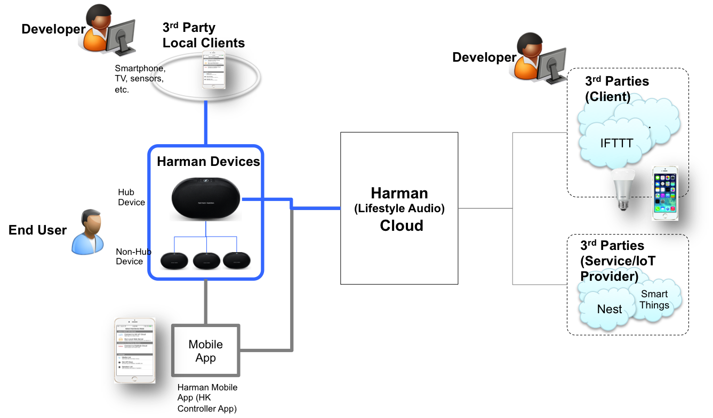
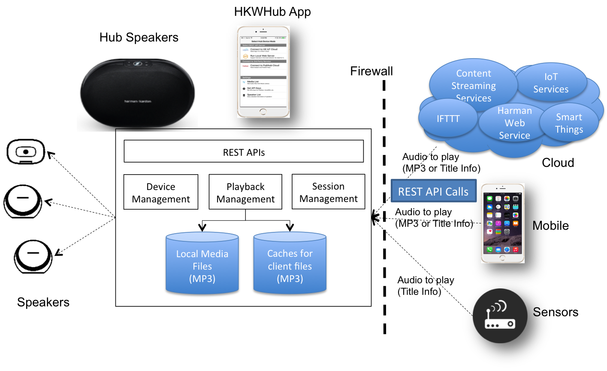
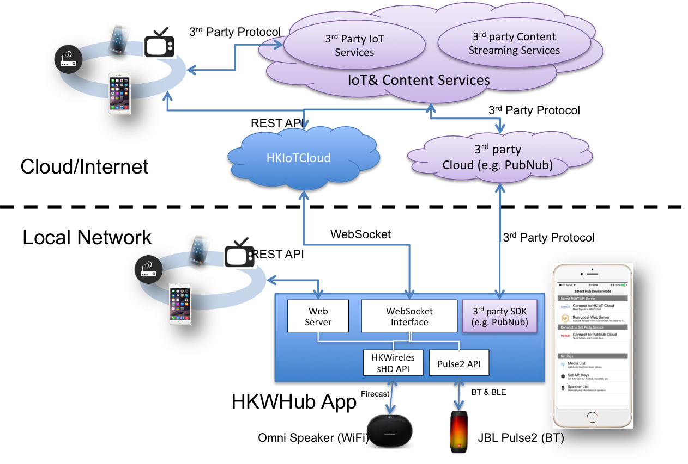
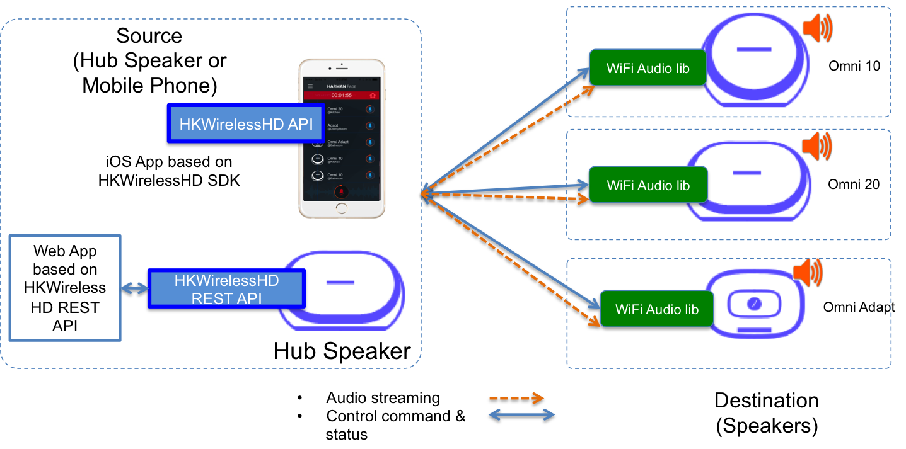
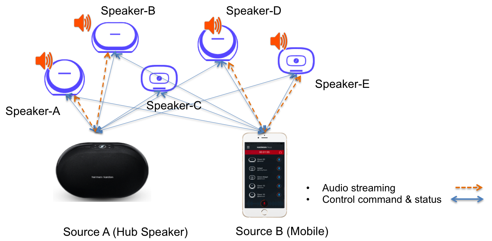
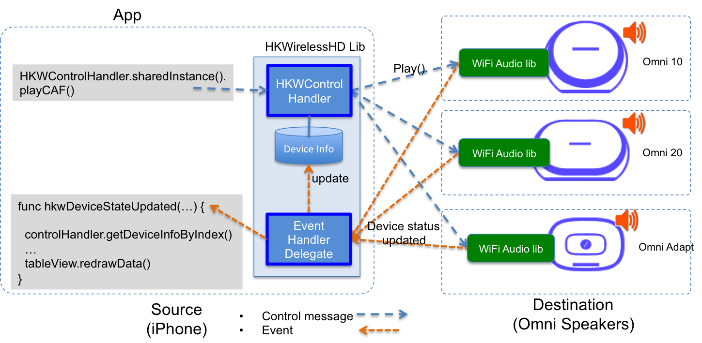

HKWirelessHD Overview 
=====================================

Connecting Omni speakers to your services or devices
------------------------------------------------------

HKWirelessHD API is designed for Harman Kardon and JBL wireless speakers to be connected with third-party services or devices in standard base web protocols. This section describes the overall use cases and architecture of HKWirelessHD API.

The following figures show the brief diagram of context diagram explaining how the Harman Kardon and JBL speakers can be connected with other devices or services.

	Context Diagram

Users (End Customer and Developer)
~~~~~~~~~~~~~~~~~~~~~~~~~~~~~~~~~~~

There are two types of users as below, and HKWirelessHD API and SDK is intended to support developers to create Harman Kardon and JBL compatible applications or services for end user.

- End user
	- Install Harman Kardon/JBL speakers and use to play sound
	- Use Harman speakers to work with 3rd party devices or services to perform IoT functions
	- Optionally, user can use voice commands to control 3rd party devices or to do voice search (this feature is not supported by the API yet.)

- Developer
	- 3rd party developers create Harman Kardon/JBL applications or services for end user based on Harman APIs or 3rd party APIs that Harman device supports.
		- e.g. Harman Cloud REST APIs
		- e.g. REST APIs provided by Harman device directly

Harman Devices
~~~~~~~~~~~~~~~~~~

Harman Kardon Omni and JBL Link  wireless speakers

Common device functions
^^^^^^^^^^^^^^^^^^^^^^^^^
Every Harman devices support the following functions:

- Play Firecast-based multi-room audio
- Support 3rd party streaming services, like Google Cast or Spotify
- Voice command
	- User can talk to any Harman device (regardless of Hub enabled or not) to initiate voice commands.
	- The response of voice command should return to the origin of the voice commands, regardless of Hub enabled or not.
- Data Analytics
	- Every Harman device needs to connect to Harman Data Analytics server to send the logs collected during the operation.

Hub-specific function
^^^^^^^^^^^^^^^^^^^^^^^^
Any Harman device will be enabled with Hub-specific functions, but only one Harman device should be selected as Hub device. (In this document, we call the Hub function-enabled devices as “Hub Device”. And the device with no hub-function enabled as “Non-Hub Device”.)

Hub device needs to perform the following additional functions:

- Communicate with the Harman Cloud to handle multi-room audio requests.
- Control local IoT devices when receiving requests from Harman cloud or voice service

Mobile App 
~~~~~~~~~~~~~

The mobile app will be used for initial setup, configuration and in some cases control of Harman devices, for example, for network setting, 3rd party service or device authorization, and so on.

It may need to communicate with Harman Cloud to get and set the configuration information from/to the cloud.

In some scenarios, it may be desirable to have remote control (off local network) of Harman devices using the cloud system as a control hub, e.g. remote paging functionality.

Harman Cloud Servers
~~~~~~~~~~~~~~~~~~~~~~

Harman Cloud communicates all with Harman users (via smartphone app or web page), Harman devices, 3rd party clients (services or devices), 3rd party providers, and other Harman internal clouds like device management (e.g. Redbend cloud, etc.) and data analytics servers.

3rd Party client service or device
~~~~~~~~~~~~~~~~~~~~~~~~~~~~~~~~~~~~

3rd party client service or device will connect to Harman Cloud and send REST API request to control Harman devices.

The following 3rd party clients are mandatory to support:

- IFTTT (https://developers.ifttt.com)

3rd Party service providers
~~~~~~~~~~~~~~~~~~~~~~~~~~~~~~~~~~

Harman Cloud can connect to 3rd party service providers to control 3rd party devices or to receive services on behalf of end customer. In most case, user will use voice commands or button presses to initiate a command to control 3rd party devices via 3rd party service provider.

For example, user will say a voice command to speaker (Harman device), then the speaker send the voice to or get it interpreted by 3rd party voice services. The result will be sent to Harman Cloud. Then, Harman Cloud connects Nest server or SmartThings servers to control user’s Nest or SmartThings devices through the 3rd party servers.

The following 3rd party services are mandatory to support:

- NEST (https://developer.nest.com)
- SmartThings (https://developer.smartthings.com)

3rd Party Local clients
~~~~~~~~~~~~~~~~~~~~~~~~~~~

3rd party client devices or application which is connected in the local network can also send requests to Harman device to control audio playback or other device control using voice command.

To support this feature, Harman devices should be able to handle REST requests from the local devices.

Use Cases
~~~~~~~~~~~~

.. figure:: img/hub/hub-use-cases.png

Hub Speaker
~~~~~~~~~~~~~

To enable your Omni speakers to be controlled by other services or devices either in the Internet or in local network, one of your speakers should become a Hub Speaker. A Hub speaker is just a regular HK Omni speaker, but is configured as a Hub. A Hub device can control other HK Omni speakers when it receives a REST requests from other clients. Hub speaker needs to be connected all the time to the HKIoTCloud which actually receives HTTP request from client in the Internet. HKIoTCloud forwards the command to the Hub speaker to control other speakers as well as Hub speaker. 

In addition, to handle HTTP requests from devices in local network, not through HKIoTCloud, Hub Speaker runs a web server inside. 

HKWHub App
~~~~~~~~~~~~

HKWHub app is an iOS app that uses HKWirelessHD SDK and acts as a Hub Speaker that handles REST requests to control speakers. Like Hub Speaker, HKWHub App is always connected to HKIoTCloud and also runs a web server inside that handles HTTP requests of REST API.

Features
^^^^^^^^^
- Supports integration with cloud-based services, smart devices or sensors
	- Receives the requests from clouds (web service) outside or sensors in the house
	- Translates the requests into HKWirelessHD commands and controls the speakers based on the requests.
	- Sends response with status of speakers to the cloud if necessary 
- Central Music Playlist manager
	- Maintain user’s media list from iOS local music library or streaming services, like MixRadio, etc.
	- Maintain a collection of sound files used for IoT use cases, like door bell, etc.

Usage
^^^^^^^^
- User may place an iOS device on the cradle and run WebHub app. Then the app acts as Web Hub. (A stationary device in a house lik AppleTV can be a nice iOS device for WebHub.)

.. figure:: img/hub/hub-app.png

Overall Architecture
~~~~~~~~~~~~~~~~~~~~~~~

HKWHub App handles requests from and sends responses to sensors, smart devices or cloud-based services to control audio playback with wireless speakers in the house.

The latest version of HKWHub app supports the following three modes:

- Cloud mode (HKIoTCloud)
	- HKWHub app communicates with HKIoTCloud to receive speaker control commands by REST API call from 3rd party services or clients.
	- HKIoTCloud handles the REST API request from any clients in the Internet. The clients can be 3rd party apps or services or devices like smartphone or sensors.
	- In this mode, any 3rd party services or clients in the Internet can reach out to HKWHub app and then control speakers and playback of audio.
	- All the 3rd party apps or services should be authorized with OAuth2 to get access token. An access token is required when 3rd party apps call the REST APIs. The detailed information about OAuth2 is available at `this link`_.
	
.. _this link: http://harmandeveloperdocs.readthedocs.org/en/latest/iOS/hkwhub-spec.html#id2

- Local Server Mode
	- HKWHub app lauches a web server internally, and then handles the REST API requests for speaker control and playback from devices, sensors or applications in the same local network. 
	- HKWHub app opens a HTTP port in the local network, so if devices or services outside of the local network want to reach out to HKWHub (and then speakers) then user needs to configure the route so that a request coming from outside can be routed to HKWHub app accordingly, such as firewall, etc.

- PubNub Cloud mode
	- HKWHub app uses PubNub API/SDK to connect to PubNub server and communicate with it to receive commands from other PubNub clients, and also sends events to other PubNub client, through a common PubNub channel.
	- By setting the same PubNub channel, any client devices or services can communicate with the HKWHub app, and then control speakers and playback of audio.
	
The following figure shows how HKWHub app handles three modes.

----

HKWirelessHD API Architecture
-------------------------------

Overall Configuration
^^^^^^^^^^^^^^^^^^^^^^

There are two types of entities in HKWirelessHD audio streaming - one is source device and the other is destination device. Source device sends audio stream to destination devices (speakers), and destination devices receive the audio stream from source and play it. In HKWirelessHD audio, audio streaming is in a one-to-many way. That is, there is one single source device sending an audio stream, and multiple destination devices receive the audio stream by synchronizing with other speakers.

In case of multi-channel streaming, each speaker is assigned with a role to process a dedicated audio channel. For example, a speaker can play either left channel or right channel in stereo mode.

Source device can be a mobile device like iPhone or Android phone, but Harman Kardon or JBL speakers, that is, a HK/JBL speaker can stream an audio to other speakers. Destination devices are Harman Kardon Omni speakers (Omni Adapt, Omni 10, Omni 20, Omni Bar, etc.) and JBL Link speakers. You can find more information on HK Omni speakers at http://www.harmankardon.com/content?ContentID=omni-v2.

	Hub Speaker controlling other speakers

Use of HKWirelessHD API to stream audio to Omni Speakers
^^^^^^^^^^^^^^^^^^^^^^^^^^^^^^^^^^^^^^^^^^^^^^^^^^^^^^^^^^

To send audio stream to destination devices, an App (either APIs for Mobile app or Web app) has to use HKWirelessHD API. HKWirelessHD SDK provides a set of APIs, library (in case of mobile app) of the APIs. 

Communication channels between source and destinations
^^^^^^^^^^^^^^^^^^^^^^^^^^^^^^^^^^^^^^^^^^^^^^^^^^^^^^^^^^

As shown in the figure above, there are two kind of communications between a source device and (multiple) destination devices.

- Channel for audio streaming - one way communication from a source to multiple destinations
	- This channel is used for transmitting audio data to destination speakers
	
- Channel for control commands and device status - bidirectional communication
	- This channel is used to send commands from the source to the destinations to control the device, like volume control, etc.
	
	- Destination device can also send commands to the source device in some cases.
		- For example, a speaker which is not belonging to the current playback session can send a command to the source to add itself to the current playback session.
		- User can add Omni speaker to the current running playback session by long-pressing the Home button on the control panel. Please refer to Omni User's Manual for more information.
		
	- This channel is also used to send the device information and the status data of a destination speakers to the source device.
		- Device information includes the speaker name, the group name, IP address and port number, firmware version, etc.
		- Device status information includes the status about the device availability and changes of its attributes, whether or not it is playing music, Wi-Fi signal strength, volume change, etc.

Asynchronous Communication
^^^^^^^^^^^^^^^^^^^^^^^^^^^^^^^^^^^^^^^^^^^^^^^^^^^^^^^^^^

The communication between the source device and the destination speakers are accomplished in asynchronous way. Asynchronous behavior is efficient because all the commands and status updates are executed in a way like RPC (Remote Procedure Call). Even more, audio streaming always involves some amount of buffering of audio data packets, so a latency  between the source and the destinations is inevitable.

Below are some examples of asynchronous communications.	

- Device availability
	- When a speaker is turned on, the availability of the speaker is reflected to the source device a few second later. This is because several steps are involved for speakers to be attached the network and become discoverable by other speakers in the same network. Likewise, if a speaker is turned off or disconnected from the network, its unavailability is reflected to the source device a few second later.

- Playback control
	- When the source device starts music playback and streaming to destination speakers, actual playback in destination speakers occurs a few hundreds milliseconds later. Similar things occur when the source pauses or stops the current audio streaming, although stop or pause requires much less time.

- Volume Control
	- When the source changes the volume level of speakers, actual volume changes occur a few millisecond later.

Speaker Management
^^^^^^^^^^^^^^^^^^^^^^^^^^^^^^^^^^^^^^^^^^^^^^^^^^^^^^^^^^

Whenever a speaker updates its status, the latest status information should be updated on the source device side as well. HKWirelessHD APIs for source-side manages the latest device status information. 

Visibility of Speakers
------------------------

Any speakers in a network are visible to source devices (iOS devices) if a source device successfully initializes the HKWControlHandler when it starts up. Source device can be multiple. This means, even in the case that a speaker is being used by a source device, the status of each speaker is also visible to all other source devices in the network, once they are successfully initialized with HKWControlHandler.

For example, as described in the figure below, let's assume that Speaker-A and Speaker-B are being used by Source A, and Speaker-D and Speaker-E are being used by Source B. Once Source A and Source B initialize HKWControlHandler, then all the speakers from Speaker-A to Speaker-E are also visible both to Source A and Source B. Therefore, it is possible for Source A to add Speaker-D to its on-going playback session, even if it is being used by Source B. In this case, Speaker-D stops playing the audio stream from Source B, and join the on-going playback audio stream from Source A.

There is an API, called isPlaying(), in DeviceInfo.h to return a boolean value indicating if the speaker is being playing audio or not, regardless that which source audio stream comes from.

Controlling Speakers and Handling the Events from Speakers
-------------------------------------------------------------

Controlling speakers
^^^^^^^^^^^^^^^^^^^^^^^^^^^^^^^^^^^^^^^^^^^^^^^^^^^^^^^^^^

Speaker controls, like start/pause/resume/stop audio streaming, change volume level, etc. are done by calling a corresponding APIs provided by the specification. 

Handling events from speakers
^^^^^^^^^^^^^^^^^^^^^^^^^^^^^^^^^^^^^^^^^^^^^^^^^^^^^^^^^^

On the other hand, receiving an event from speakers is different. Because REST API is basically one-directional communication initiated by a client, it is hard for speaker as a server to report an event to a client when necessary. 
So, the client of Web app need to call corresponding APIs for checking events regularly, in a way of polling.
